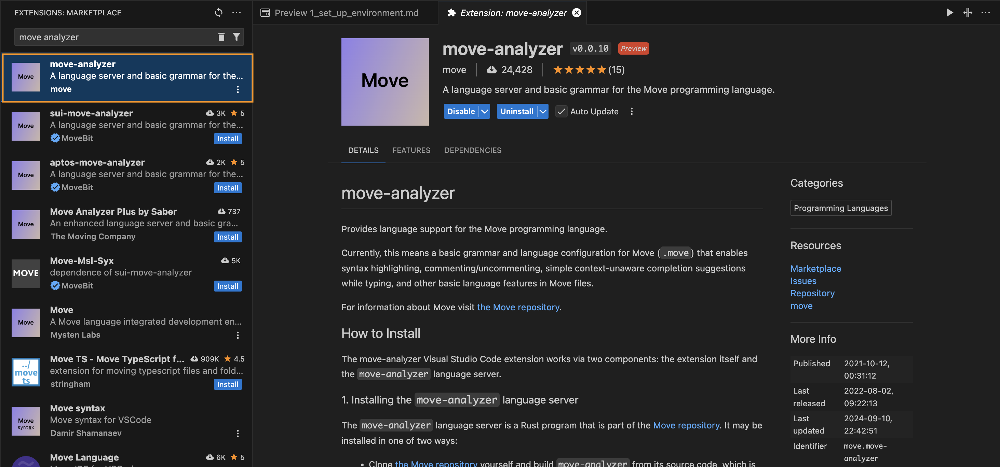
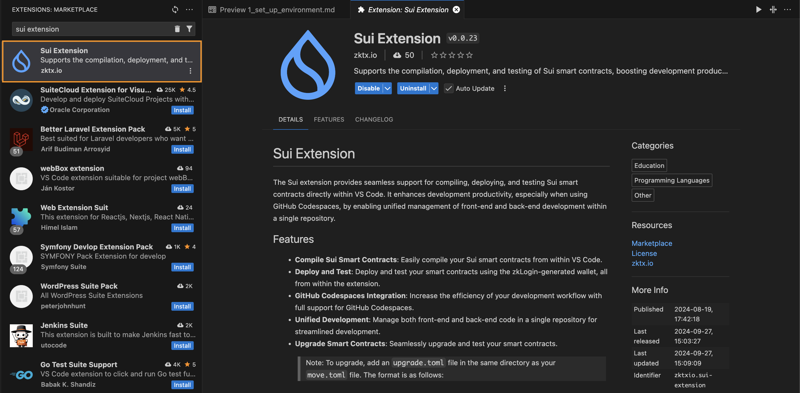
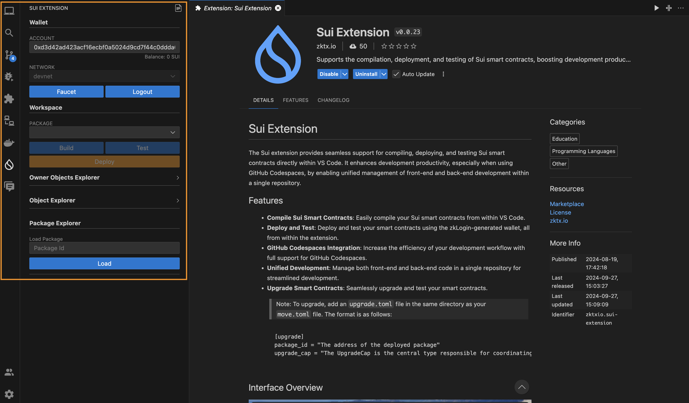

# 개발 환경 설정

Sui Move 튜토리얼 과정에 오신 것을 환영합니다. 첫 번째 챕터에서는 Sui Move 개발 환경을 설정하는 과정을 안내하고, 간단한 Hello World 프로젝트를 만들어 Sui 환경에 익숙해지는 것이 목표입니다. 먼저 Sui 개발 환경을 설정해보겠습니다.

## Sui 바이너리 로컬 설치

1. [Sui 설치 - Homebrew or Chocolatey](https://docs.sui.io/guides/developer/getting-started/sui-install#install-homebrew)
    - MacOS, Linux 사용자라면?
    ```
    brew install sui
    ```

    - Window 사용자라면?
    ```
    choco install sui
    ```

2. Sui 바이너리 직접 설치

    1번 방법으로 설치에 성공했다면, 2번 방법은 생략해도 됩니다. 바로 3번 안내대로 설치 여부를 확인해보세요.

    1번의 Homebrew, Chocolatey 설치가 가장 간편하고, 안정적인 설치 방법입니다.
    1번 방법을 가장 추천드리지만, 실패하거나 설치 과정을 직접 관리하고 싶은 분들은 아래 링크를 참고해서 바이너리를 직접 설치하시면 됩니다.

    [Sui 바이너리 설치 방법](https://docs.sui.io/guides/developer/getting-started/sui-install#install-binaries)

3. 바이너리가 성공적으로 설치되었는지 확인:

    `sui --version`

    =>

    ```
    sui 1.33.1-homebrew
    ```

    터미널에 버전 번호가 표시되면 Sui 바이너리가 정상적으로 설치된 것입니다.

## (선택사항) 사전 설치된 Sui 바이너리가 있는 Docker 이미지 사용
[Sui 바이너리 로컬 설치](#sui-바이너리-로컬-설치)에 성공했다면, Docker 이미지는 사용하지 않아도 됩니다. 로컬 설치를 하지 않고, Docker를 사용하고자 하는 분들만 아래 방법대로 설치하면 됩니다.

1. [Docker 설치](https://docs.docker.com/get-docker/)

2. Sui 공식 Docker 이미지 가져오기

    `docker pull mysten/sui-tools:devnet`

3. Docker 컨테이너 시작 및 접속:

    `docker run --name suidevcontainer -itd mysten/sui-tools:devnet`

    `docker exec -it suidevcontainer bash`

*💡참고: 위의 Docker 이미지가 CPU 아키텍처와 호환되지 않는 경우, 해당 CPU 아키텍처에 맞는 [Rust](https://hub.docker.com/_/rust) Docker 이미지를 사용해 시작하고, 위에서 설명한 대로 Sui 바이너리 및 필수 사항을 설치할 수 있습니다.*

## (선택 사항) VS Code 플러그인 설정

### Move Analyzer

Move 언어로 프로그래밍할 때, Move 문법에 따라 하이라이팅해주는 도구로 Move 코드를 작성할 때 유용한 도구입니다.



1. VS Marketplace에서 [Move Analyzer 플러그인](https://marketplace.visualstudio.com/items?itemName=move.move-analyzer) 설치

`move`에서 만든 move-analyzer를 사용해야 합니다.

2. Sui 스타일 지갑 주소와의 호환성 추가:

    `cargo install --git https://github.com/move-language/move move-analyzer --features "address20"`


### Sui Extension

Sui CLI를 직접 사용하지 않고, VS Code 상에서 버튼 클릭으로 쉽게 스마트 컨트랙트를 빌드, 테스트, 배포할 수 있는 도구입니다. Sui CLI가 익숙치 않거나, 편하게 배포하고 싶으신 분들에게 유용한 도구입니다.



1. VS Marketplace에서 [Sui Extension 플러그인](https://marketplace.visualstudio.com/items?itemName=zktxio.sui-extension) 설치

`zktx.io` 에서 만든 Sui Extension을 사용해야 합니다.

2. 설치가 완료되면 사이드바에 Sui Extension 탭이 생기고, 해당 탭에서 컨트랙트 빌드, 배포 / Object 확인 등 작업을 손쉽게 진행할 수 있습니다.




## Sui CLI 기본 사용법

[참고 페이지](https://docs.sui.io/build/cli-client)

### 초기화
- `Sui 풀 노드 서버에 연결하시겠습니까?`에 `Y`를 입력하고 `Enter`를 눌러 Sui Devnet 풀 노드에 기본 연결
- 키 스킴 선택에서 `0`을 입력하여 [`ed25519`](https://ed25519.cr.yp.to/) 선택

### 네트워크 관리

- 네트워크 변경: `sui client switch --env [네트워크 별칭]`
- 기본 네트워크 별칭: 
    - localnet: http://0.0.0.0:9000
    - devnet: https://fullnode.devnet.sui.io:443
- 현재 모든 네트워크 별칭 목록 보기: `sui client envs`
- 새 네트워크 별칭 추가: `sui client new-env --alias <ALIAS> --rpc <RPC>`
    - 예시: `sui client new-env --alias testnet --rpc https://fullnode.testnet.sui.io:443`를 사용해 testnet 별칭 추가

### 활성 주소 및 가스 객체 확인

- 키 스토어에 있는 현재 주소 확인: `sui client addresses`
- 활성 주소 확인: `sui client active-address`
- 관리 중인 모든 가스 객체 목록 보기: `sui client gas`

## Devnet 또는 Testnet Sui 토큰 얻기

1. [Sui Discord 참여](https://discord.gg/sui)
2. 인증 절차 완료
3. Devnet 토큰은 [`#devnet-faucet`](https://discord.com/channels/916379725201563759/971488439931392130) 채널에서, Testnet 토큰은 [`#testnet-faucet`](https://discord.com/channels/916379725201563759/1037811694564560966) 채널에서 요청
4. `!faucet <지갑 주소>` 명령어 입력