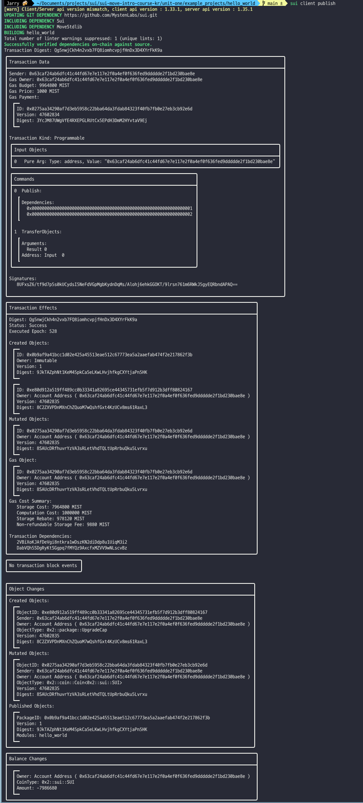
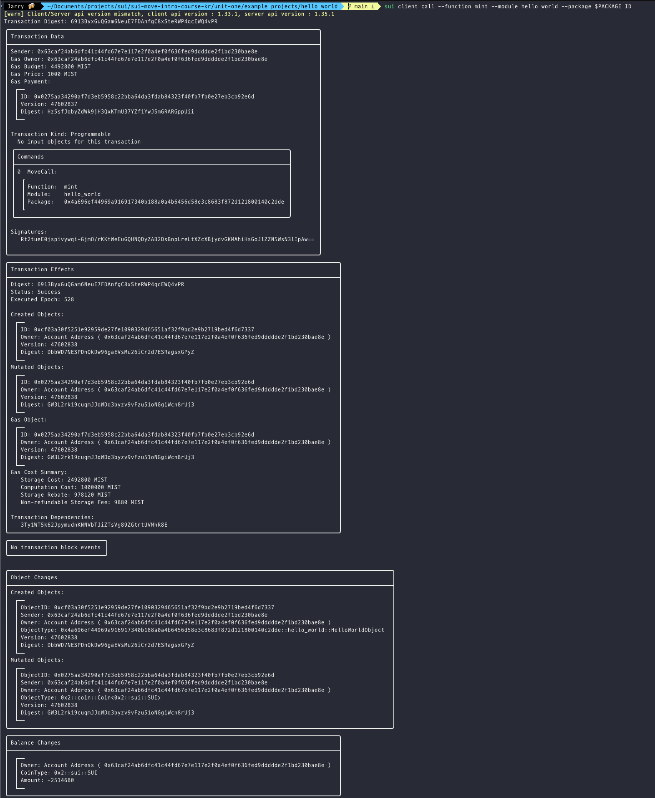
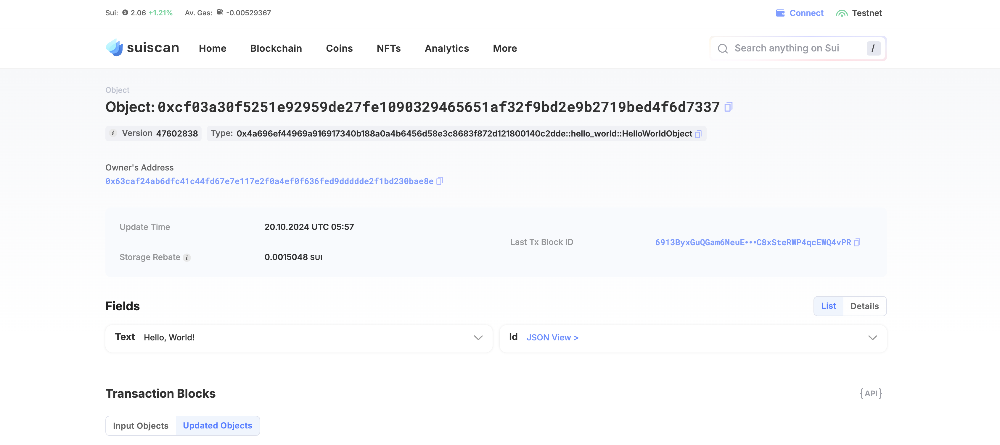

# 컨트랙트 배포와 Hello World 데모

## 완성된 Hello World 샘플 프로젝트

완성된 Hello World 프로젝트는 [이 디렉토리](../example_projects/hello_world)에서 확인할 수 있습니다.

## 컨트랙트 배포하기

Sui CLI를 사용하여 패키지를 Sui 네트워크에 배포할 것입니다. 
패키지는 Sui devnet, testnet 또는 로컬 노드에 배포할 수 있으며, 각각의 네트워크에 Sui CLI를 설정하고 가스 비용을 지불할 충분한 토큰을 가지고 있어야 합니다.

패키지를 배포하는 Sui CLI 명령어는 다음과 같습니다:

```bash
sui client publish --gas-budget <gas_budget> [배포할 패키지의 절대 경로]
```

gas_budget에는 20000000과 같은 기본 값을 사용하거나 생략해도 됩니다.

패키지의 절대 경로를 제공하지 않으면 기본적으로 . 또는 현재 디렉토리가 설정됩니다.

컨트랙트가 성공적으로 배포되면 출력은 다음과 비슷하게 나타날 것입니다:



Published Objects 섹션 아래에 있는 객체 ID가 방금 배포한 Hello World 패키지의 객체 ID입니다.

이 값을 변수로 저장해보겠습니다.

```bash
export PACKAGE_ID=<이전 출력에서 가져온 패키지 객체 ID>
```

## 트랜잭션을 통한 메서드 호출

다음으로, 방금 배포한 스마트 컨트랙트의 `mint` 함수를 호출하여 Hello World 객체를 생성하고자 합니다.

이것이 가능한 이유는 `mint`가 엔트리 함수이기 때문입니다.

Sui CLI를 사용하여 이를 실행하는 명령어는 다음과 같습니다:

```bash
sui client call --function mint --module hello_world --package $PACKAGE_ID --gas-budget 10000000
```

mint 함수가 성공적으로 호출되고 Hello World 객체가 생성되어 전송되었다면 콘솔 출력은 다음과 비슷하게 나타날 것입니다:



출력의 `Created Objects` 섹션 아래에 있는 객체 ID가 Hello World 객체의 ID입니다.

## Sui Explorer로 객체 확인하기

이제 [Sui Explorer](https://suiexplorer.com/)를 사용해서 방금 생성하고 전송한 Hello World 객체를 확인해보겠습니다.

오른쪽 상단의 메뉴를 통해 사용 중인 네트워크를 선택하세요.

로컬 dev 노드를 사용하는 경우 Custom RPC URL 옵션을 선택하고 다음을 입력하세요:

```bash
http://127.0.0.1:9000
```

Search for the object ID from the output of the previous transaction and you should be able to find the object on the explorer:

이전 트랜잭션 출력에서 나온 객체 ID를 검색하면 익스플로러에서 해당 객체를 찾을 수 있을 것입니다:



객체 속성 아래에 “Hello World!“라는 텍스트가 표시될 것입니다.

잘하셨습니다! 이렇게 해서 첫 번째 단원이 마무리되었습니다.
