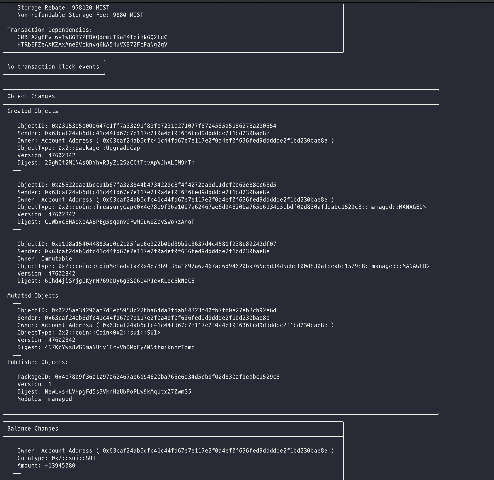
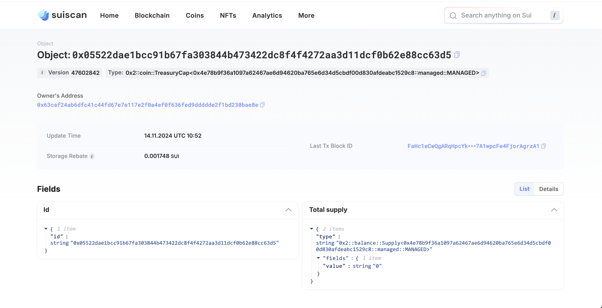
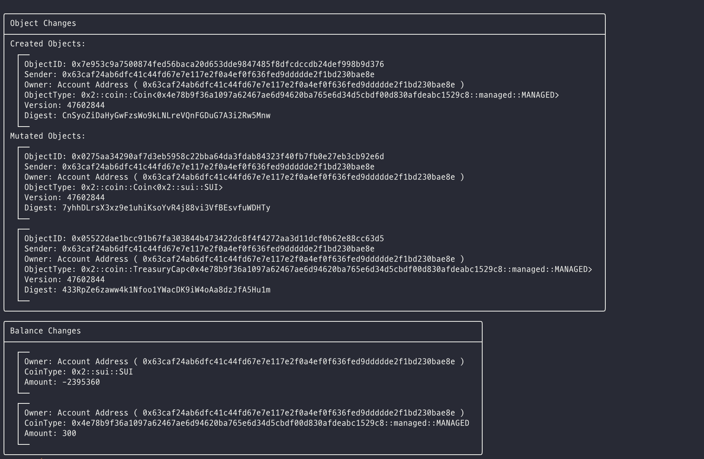
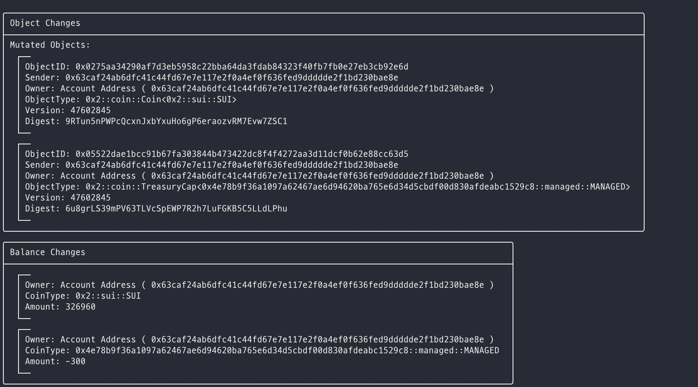

# Managed Coin 예제

이제 `sui::coin` 모듈의 내부를 살펴보았으니, 신뢰할 수 있는 관리자가 발행 및 소각 권한을 가진 커스텀 대체 가능 토큰을 생성하는 간단한 예제를 살펴보겠습니다. 이는 여러 ERC-20 구현과 유사한 구조입니다.

## 스마트 컨트랙트

전체 [Managed Coin 예제 컨트랙트](../example_projects/fungible_tokens/sources/managed.move)는 예제 프로젝트 폴더에서 확인할 수 있습니다.

지금까지 다룬 내용을 바탕으로 이 컨트랙트는 비교적 쉽게 이해할 수 있을 것입니다. 이 컨트랙트는 `witness` 리소스가 `MANAGED`라는 이름을 가지며 모듈 `init` 함수에 의해 자동 생성되는 [One Time Witness](./3_witness_design_pattern.md#일회성-Witness) 패턴을 정확히 따릅니다.

`init` 함수는 `coin::create_currency`를 호출하여 `TreasuryCap` 및 `CoinMetadata` 리소스를 생성합니다. 이 함수에 전달되는 매개변수는 `CoinMetadata` 객체의 필드로, 토큰 이름, 심볼, 아이콘 URL 등을 포함합니다.

`CoinMetadata`는 생성된 후 바로 `transfer::freeze_object` 메서드를 통해 [불변 공유 객체](../../unit-two/lessons/2_ownership.md#불변-공유-객체)로 설정되어 누구든지 조회할 수 있습니다.

`TreasuryCap` [Capability](../../unit-two/lessons/6_capability_design_pattern.md) 객체는 `mint` 및 `burn` 메서드에 대한 접근을 제어하는 역할을 하며, 이 메서드들은 각각 `Coin<MANAGED>` 객체를 생성하거나 소각합니다.

## 배포 및 CLI 테스트

### 모듈 배포

[fungible_tokens](../example_projects/fungible_tokens/) 프로젝트 폴더에서 다음을 실행합니다:

```bash
    sui client publish --gas-budget 10000000
```

콘솔 출력은 다음과 같이 표시됩니다:



생성된 두 개의 불변 객체는 각각 패키지 자체와 `Managed Coin`의 `CoinMetadata` 객체입니다. 트랜잭션 발신자에게 전달된 소유 객체는 `Managed Coin`의 `TreasuryCap` 객체입니다.



패키지 객체와 `TreasuryCap` 객체의 ID를 환경 변수로 저장합니다:

```bash
export PACKAGE_ID=<이전 출력의 패키지 객체 ID>
export TREASURYCAP_ID=<이전 출력의 treasury cap 객체 ID>
```

### 토큰 발행

`MNG` 토큰을 발행하려면 다음 CLI 명령어를 사용할 수 있습니다:

```bash
    sui client call --function mint --module managed --package $PACKAGE_ID --args $TREASURYCAP_ID <발행할 양> <수신자 주소> --gas-budget 10000000
```



Export the object ID of the newly minted `COIN<MANAGED>` object to a bash variable:
새로 발행된 `COIN<MANAGED>` 객체의 ID를 bash 변수로 저장합니다:

```bash
export COIN_ID=<이전 출력의 코인 객체 ID>
```

`TreasuryCap<MANAGED>` 객체의 `Supply` 필드가 발행된 양만큼 증가했는지 확인합니다.

### 토큰 소각

기존의 `COIN<MANAGED>` 객체를 소각하려면 다음 CLI 명령어를 사용합니다:

```bash
    sui client call --function burn --module managed --package $PACKAGE_ID --args $TREASURYCAP_ID $COIN_ID --gas-budget 10000000
```



`TreasuryCap<MANAGED>` 객체의 `Supply` 필드가 다시 0으로 돌아왔는지 확인합니다.

*연습: 대체 가능 토큰에 필요할 만한 다른 일반적인 기능은 무엇이 있을까요? 이제 Move로 프로그래밍할 만큼 충분한 지식을 가지고 있으니 이러한 기능을 구현해 보세요.*
