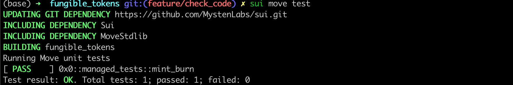

# 단위 테스트(Unit Testing)

Sui는 [Move Testing Framework](https://github.com/move-language/move/blob/main/language/documentation/book/src/unit-testing.md)를 지원합니다. 이번 섹션에서는 `Managed Coin`에 대한 단위 테스트를 작성하여 테스트 코드 작성 및 실행 방법을 설명합니다.

## 테스트 환경

Sui Move 테스트 코드는 일반 Sui Move 코드와 유사하지만, 실제 프로덕션 코드와 구분되기 위해 특별한 어노테이션과 함수가 필요합니다.  
테스트 함수 또는 모듈은 `#[test]` 또는 `#[test_only]` 어노테이션을 사용하여 시작합니다.

```rust
#[test_only]
module fungible_tokens::managed_tests {
  #[test]
  fun mint_burn() {
  }
}
```

`Managed Coin`의 단위 테스트는 `managed_tests`라는 별도의 테스트 모듈에 작성할 예정입니다.

해당 모듈 내의 각 함수는 하나 이상의 트랜잭션으로 구성된 단위 테스트를 나타냅니다. 여기에서는 `mint_burn`이라는 단위 테스트를 작성합니다.

## 테스트 시나리오

테스트 환경 내에서는 [`test_scenario` 패키지](https://github.com/MystenLabs/sui/blob/main/crates/sui-framework/packages/sui-framework/sources/test/test_scenario.move)를 활용하여 런타임 환경을 시뮬레이션합니다.
여기서 중요한 객체는 `Scenario` 객체입니다. `Scenario`는 다중 트랜잭션 시퀀스를 시뮬레이션하며, 다음과 같이 송신자 주소와 함께 초기화할 수 있습니다:

```rust
// 모의 송신자 주소 초기화
let addr1 = @0xA;
// addr1을 송신자로 설정하여 다중 트랜잭션 시나리오 시작
let scenario = test_scenario::begin(addr1);
...
// 시나리오 객체 정리
test_scenario::end(scenario);  
```
*💡 `Scenario` 객체는 자동으로 정리(droppable)되지 않으므로, 스코프 종료 시 반드시 `test_scenario::end`를 호출하여 정리해야 합니다.*

### 모듈 상태 초기화

`Managed Coin` 모듈을 테스트하기 위해 먼저 모듈 상태를 초기화해야 합니다.
모듈에 `init` 함수가 존재한다면, `managed` 모듈 내에 #[test_only] 어노테이션을 사용하여 테스트용 `init` 함수를 생성해야 합니다:

```rust
#[test_only]
    /// 테스트용 모듈 초기화 래퍼 함수
    public fun test_init(ctx: &mut TxContext) {
        init(MANAGED {}, ctx)
    }
```

이 함수는 테스트 시에만 사용되는 모의 `init` 함수입니다.
이제 테스트 시나리오 내에서 다음과 같이 이 함수를 호출하여 런타임 상태를 초기화할 수 있습니다:

```rust
    // managed coin 모듈 초기화 함수 실행
    {
        managed::test_init(ctx(&mut scenario))
    };
```

### 발행(Minting)

테스트 시나리오에서 [`next_tx` 메서드](https://github.com/MystenLabs/sui/blob/232d616eec1b16dd8fff24f7c5ae0704e8c594f4/crates/sui-framework/packages/sui-framework/sources/test/test_scenario.move#L114)를 사용하여 다음 트랜잭션으로 넘어가 `Coin<MANAGED>` 객체를 발행합니다.

먼저 `TreasuryCap<MANAGED>` 객체를 가져와야 합니다.
이를 위해 `take_from_sender`라는 특수 테스트 함수를 사용합니다. `take_from_sender` 함수를 호출할 때는 가져올 객체 타입을 타입 파라미터로 전달해야 합니다.

그 후 필요한 매개변수를 전달하여 `managed::mint` 함수를 호출합니다.
트랜잭션 종료 시 `TreasuryCap<MANAGED>` 객체를 `test_scenario::return_to_address`를 통해 송신자 주소로 반환해야 합니다.

```rust
next_tx(&mut scenario, addr1);
{
  let treasurycap = test_scenario::take_from_sender<TreasuryCap<MANAGED>>(&scenario);
  managed::mint(&mut treasurycap, 100, addr1, test_scenario::ctx(&mut scenario));
  test_scenario::return_to_address<TreasuryCap<MANAGED>>(addr1, treasurycap);
};
```

### 소각(Burning)

토큰 소각 테스트 절차는 발행 테스트와 거의 동일합니다.
다만, 소각 시에는 발행된 `Coin<MANAGED>` 객체를 소유자에게서 가져와야 합니다.

## 단위 테스트 실행

[`managed_tests`](../example_projects/fungible_tokens/sources/managed_tests.move) 모듈의 전체 소스 코드는 `example_projects` 폴더에서 확인할 수 있습니다.

CLI에서 프로젝트 디렉토리로 이동한 후, 아래 명령어를 입력하여 단위 테스트를 실행합니다:

```bash
  sui move test
```

테스트가 통과하거나 실패한 결과가 콘솔에 출력됩니다.




