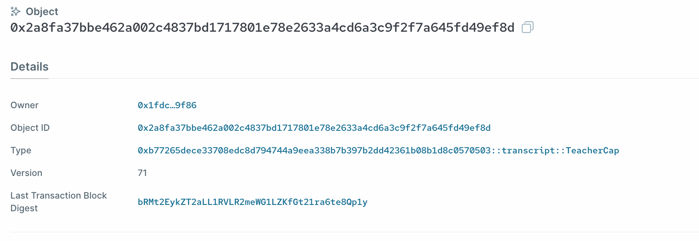

# 권한 디자인 패턴

이제 성적표 발행 시스템의 기초를 이해했으니, 스마트 컨트랙트에 접근 제어를 추가하고자 합니다.

**Capability**는 Move에서 자주 사용되는 패턴으로, 객체 중심 모델을 사용해 세밀한 접근 제어를 가능하게 합니다. 이 권한 객체를 어떻게 정의할 수 있는지 살펴보겠습니다:

```rust
  // 성적표를 생성, 수정, 삭제할 수 있는 권한을 나타내는 타입
public struct TeacherCap has key {
    id: UID
  }
```

우리는 성적표에 대한 권한이 있는지를 나타내는 `TeacherCap`이라는 새로운 구조체를 정의합니다. 만약 이 권한이 양도/전송 불가능하도록 하려면, store 능력을 구조체에 추가하지 않으면 됩니다.

*💡참고: 이는 Move에서 **소울바운드 토큰(SBT)**을 쉽게 구현하는 방법이기도 합니다. `key` 능력은 있지만 `store` 능력이 없는 구조체를 정의하면 됩니다.*

## 권한 객체 전달 및 소모

다음으로, `TeacherCap` 권한 객체를 가진 사람만 해당 메서드를 호출할 수 있도록, 권한을 추가 매개변수로 받아 즉시 소모하는 방식으로 메서드를 수정해야 합니다.

예를 들어, `create_wrappable_transcript_object` 메서드는 다음과 같이 수정할 수 있습니다:

```rust
    public fun create_wrappable_transcript_object(_: &TeacherCap, history: u8, math: u8, literature: u8, ctx: &mut TxContext) {
        let wrappableTranscript = WrappableTranscript {
            id: object::new(ctx),
            history,
            math,
            literature,
        };
        transfer::transfer(wrappableTranscript, tx_context::sender(ctx))
    }
```

우리는 `TeacherCap` 권한 객체의 참조를 전달하고, 이를 사용하지 않는 변수나 파라미터를 나타내는 `_` 표기법을 사용하여 즉시 소모합니다. 여기서 중요한 점은, 객체의 참조만 전달되었기 때문에 참조를 소모하더라도 원래 객체에는 영향을 미치지 않는다는 것입니다.

*퀴즈: 만약 `TeacherCap`을 값으로 전달하면 어떻게 될까요?*

이 방식으로, `TeacherCap` 객체를 가진 주소만 이 메서드를 호출할 수 있게 되어, 효과적으로 접근 제어가 구현됩니다.

성적표에 대한 작업을 수행하는 다른 메서드들도 이와 유사하게 수정하여 접근 제어를 구현합니다.

## 초기화 함수

모듈의 초기화 함수는 모듈이 배포될 때 한 번만 호출됩니다. 이 함수는 스마트 컨트랙트의 초기 상태를 설정하는 데 유용하며, 초기 권한 객체 세트를 배포하는 데 자주 사용됩니다.

우리 예시에서는 `init` 메서드를 다음과 같이 정의할 수 있습니다:

```rust
    /// 모듈 초기화 함수는 모듈 배포 시 한 번만 호출됩니다.
    fun init(ctx: &mut TxContext) {
        transfer::transfer(TeacherCap {
            id: object::new(ctx)
        }, tx_context::sender(ctx))
    }
```

이 코드는 모듈이 처음 배포될 때 `TeacherCap` 객체 한 개를 생성하고 배포자의 주소로 전송합니다.

배포 트랜잭션의 결과는 아래와 같이 Sui Explorer에서 확인할 수 있습니다:


위 트랜잭션에서 생성된 두 번째 객체는 `TeacherCap` 객체이며, 배포자 주소로 전송됩니다:



*퀴즈: 첫 번째로 생성된 객체는 무엇일까요?*

## 추가 교사 또는 관리자 추가

추가적인 주소에 관리자 권한을 부여하려면, 다음과 같이 추가적인 `TeacherCap` 객체를 생성하고 전송하는 메서드를 정의할 수 있습니다:

```rust
    public fun add_additional_teacher(_: &TeacherCap, new_teacher_address: address, ctx: &mut TxContext){
        transfer::transfer(
            TeacherCap {
                id: object::new(ctx)
            },
        new_teacher_address
        )
    }
```

이 메서드는 `TeacherCap`을 재사용하여 접근 제어를 수행하지만, 필요에 따라 수퍼유저 권한을 나타내는 새로운 권한 구조체를 정의할 수도 있습니다.

**여기까지 작성한 세 번째 작업 진행 중인 코드 버전은 다음에서 확인할 수 있습니다: [WIP transcript.move](../example_projects/transcript/sources/transcript_3.move_wip)**
