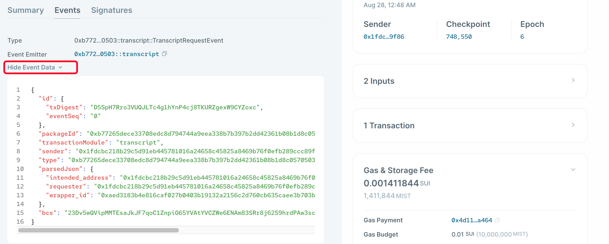

# 이벤트

이벤트는 Sui Move 스마트 컨트랙트에서 매우 중요합니다. 인덱서가 온체인에서 발생한 액션을 추적하는 주요 방식이기 때문입니다. 서버 백엔드에서의 로깅과 유사하게 이해할 수 있으며, 인덱서는 이를 파싱하는 역할을 합니다.

Sui의 이벤트는 객체로도 표현됩니다. Sui에는 여러 종류의 시스템 수준 이벤트가 있으며, 여기에는 Move 이벤트, Publish 이벤트, Transfer 객체 이벤트 등이 포함됩니다. 시스템 이벤트 유형의 전체 목록은 [Sui Events API 페이지](https://docs.sui.io/build/event_api)에서 확인할 수 있습니다.

트랜잭션의 이벤트 세부 정보는 [Sui Explorer](https://suiexplorer.com/)의 `Events` 탭에서 확인할 수 있습니다:


## 커스텀 이벤트

개발자는 Sui에서 커스텀 이벤트도 정의할 수 있습니다. 예를 들어, 성적표 요청이 발생했을 때 이를 기록하는 커스텀 이벤트를 다음과 같이 정의할 수 있습니다.

```rust
    /// 성적표 요청이 발생했음을 기록하는 이벤트
    public struct TranscriptRequestEvent has copy, drop {
        // 성적표 래퍼의 객체 ID
        wrapper_id: ID,
        // 성적표 요청자
        requester: address,
        // 성적표의 지정된 수신자 주소
        intended_address: address,
    }
```

이벤트를 나타내는 타입은 `copy`와 `drop` 능력을 가집니다. 이벤트 객체는 자산(asset)을 나타내지 않으며, 우리는 그 안에 포함된 데이터에만 관심이 있기 때문에 복제할 수 있고, 범위(scope)가 끝날 때 삭제될 수 있습니다.

Sui에서 이벤트를 발생시키려면 `sui::event::emit` 메서드를 사용하기만 하면 됩니다.

`request_transcript` 메서드를 수정하여 이 이벤트를 발생시키도록 해봅시다:

```rust
    public fun request_transcript(transcript: WrappableTranscript, intended_address: address, ctx: &mut TxContext){
        let folderObject = Folder {
            id: object::new(ctx),
            transcript,
            intended_address
        };
        // TranscriptRequestEvent 발행
        event::emit(TranscriptRequestEvent {
            wrapper_id: object::uid_to_inner(&folderObject.id),
            requester: tx_context::sender(ctx),
            intended_address,
        });
        transfer::transfer(folderObject, intended_address);
    }
```

Sui Explorer에서, 우리는 `TranscriptRequestEvent` 이벤트로 정의한 세 개의 데이터 필드가 표시된 이벤트를 다음과 같이 확인할 수 있습니다:



**여기에서 성적표 샘플 프로젝트의 전체 버전을 확인할 수 있습니다: [transcript.move](../example_projects/transcript/sources/transcript.move)**

Sui CLI 클라이언트와 Sui Explorer를 사용하여 성적표를 생성하고, 요청하고, 언패킹하는 작업을 시도해 보고 결과를 확인해보세요.

이로써 두 번째 단원이 끝났습니다. 수고하셨습니다!